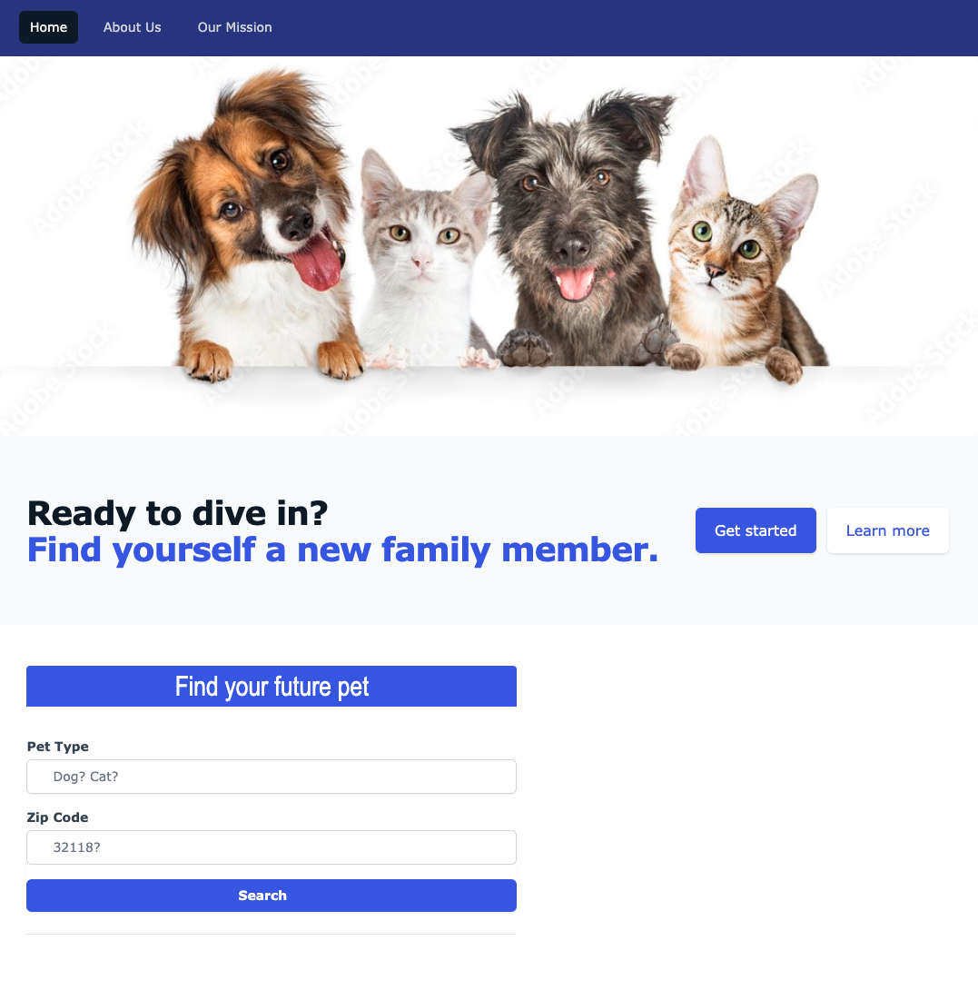

# The Paw Path

## Description

- Our motivation was to give the user an opportunity to provide a forever home to that lucky pet. 
- We wanted to supply the user with information and direct location to the shelter.
- We've made the ThePawPath app to show the capabilities of APIs and how current day technology is used to make webpages/apps that's beyond our imagination.

## Preview   

## LINK  
https://unnamedmistress.github.io/thepawpath/

## Installation
N/A

## Usage

This Pet adoption app can be used to find any dog or cat of your desire in any location! To navigate this application, a user can click the "get started" button underneath the header image, which will redirect them to the search bar. Here the user can input the type of pet they are looking for, along with the zipcode of their location into the search bar inputs located on the left side of the screen. When the user clicks the search button, they are presented with cards of their desired animal type avaiable for adoption within 50 miles of their zipcode input. Each pet card provides the user with a picture of the animal, their name, gender, how many miles away from their zipcode they are, a brief scrollable description, the city, state, and zip code of their location, along with a clickable link to the pet adoption organization they are located at. A map will also be displayed for the user above the pet cards, with map markers for each pet adoption organization location. When a user clicks on the marker, the organization's address, phone number, and website are displayed. These url links in the marker info windows are clickable and will redirect the user to the pet adoption's website. The user can also find "About Us" and "Our Mission" pages in the navbar, which will provde them with further information about the project objectives and collaborators. Additionally, when the user clicks the "learn more" button underneath the header image, they are redirected to the "Our Mission" page.

## Technologies Used
* Google Maps Javascript API
* Google Maps Geocoding API
* Rescue Groups Org API
* Tailwind CSS
  
## Credits

Chrysti Reichert, Ashlynn Wood, Justin Delgado and Francesco Tata.

## License

MIT License

Copyright (c) [2023] [Chrysti Reichert,Ashlynn Wood, Justin Delgado and Francesco Tata]

Permission is hereby granted, free of charge, to any person obtaining a copy
of this software and associated documentation files (the "Software"), to deal
in the Software without restriction, including without limitation the rights
to use, copy, modify, merge, publish, distribute, sublicense, and/or sell
copies of the Software, and to permit persons to whom the Software is
furnished to do so, subject to the following conditions:

The above copyright notice and this permission notice shall be included in all
copies or substantial portions of the Software.

THE SOFTWARE IS PROVIDED "AS IS", WITHOUT WARRANTY OF ANY KIND, EXPRESS OR
IMPLIED, INCLUDING BUT NOT LIMITED TO THE WARRANTIES OF MERCHANTABILITY,
FITNESS FOR A PARTICULAR PURPOSE AND NONINFRINGEMENT. IN NO EVENT SHALL THE
AUTHORS OR COPYRIGHT HOLDERS BE LIABLE FOR ANY CLAIM, DAMAGES OR OTHER
LIABILITY, WHETHER IN AN ACTION OF CONTRACT, TORT OR OTHERWISE, ARISING FROM,
OUT OF OR IN CONNECTION WITH THE SOFTWARE OR THE USE OR OTHER DEALINGS IN THE
SOFTWARE.